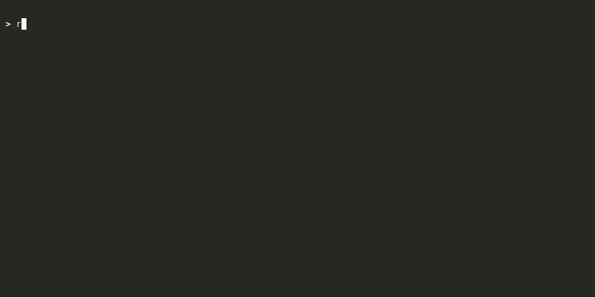
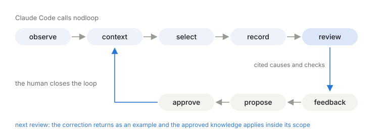
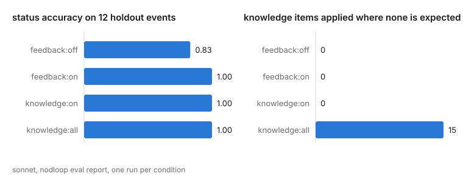

Runbook-grounded incident reviews inside Claude Code. Your corrections become approved knowledge that feeds the next review.

[](https://github.com/jeon-jihyeon/nodloop/releases) [](https://github.com/jeon-jihyeon/nodloop/actions/workflows/test.yml) [](https://goreportcard.com/report/github.com/jeon-jihyeon/nodloop)  



## Quickstart

```
/plugin marketplace add jeon-jihyeon/nodloop
/plugin install nodloop@nodloop
```

On first run, the plugin downloads its binary and unpacks a demo set of 24 synthetic ad-traffic events. Then run one full loop:

```
> review event tq-023 with nodloop
> That is attribution lag. Conversions arrive up to 4 hours after the click, so the newest 4 hours always read low. Record that as feedback and propose it as knowledge.
> approve it, approver <your name>
> review event tq-024 with nodloop
```

The second review applies the knowledge you approved. When you are done with the demo, ask Claude Code to point nodloop at your own events and runbooks.

## How it works

<picture>
  <source media="(prefers-color-scheme: dark)" srcset=".github/loop-dark.svg">
  
</picture>

Claude Code writes the review with its own model, so there's no API key to set up. nodloop gives it the numbers, computed from your events by plain code, and the runbook paragraphs it can cite. A cause without a citation puts the review on hold.

When you correct a review, the correction can become a knowledge item. It's used only after someone approves it, and only on events that match its scope. Reviews, verdicts and knowledge versions are all kept in `~/.nodloop/records`.

## Measured

The eval holds out 12 of the 24 demo events and reviews them with Sonnet. With no feedback, 10 of 12 got the right status. With corrections or approved knowledge, all 12 did. Applying every knowledge item regardless of scope also gets 12, but drags in 15 items that don't belong.

<picture>
  <source media="(prefers-color-scheme: dark)" srcset=".github/measured-dark.svg">
  
</picture>

| condition | events | status acc | hold acc | citation p | citation r | required checks | first check | knowledge hit | misapplied | revised | mean cost usd |
|---|---|---|---|---|---|---|---|---|---|---|---|
| seed | 12 | 0.83 | 1.00 | 0.43 | 0.92 | 0.69 | 0.38 | 0.00 | 0 | 0 | 0.0661 |
| feedback:off | 12 | 0.83 | 1.00 | 0.51 | 0.92 | 0.94 | 0.62 | 0.00 | 0 | 1 | 0.0516 |
| feedback:on | 12 | 1.00 | 1.00 | 0.71 | 1.00 | 1.00 | 0.62 | 0.00 | 0 | 0 | 0.0434 |
| knowledge:on | 12 | 1.00 | 1.00 | 0.57 | 1.00 | 0.94 | 0.50 | 1.00 | 0 | 0 | 0.0375 |
| knowledge:all | 12 | 1.00 | 1.00 | 0.48 | 0.92 | 0.81 | 0.50 | 1.00 | 15 | 0 | 0.0423 |

Run `nodloop eval seed`, `holdout` and `report` to reproduce the table.

## Guard

`nodloop guard` blocks tool calls you've vetoed before they run. It's a PreToolUse hook, so the model can't talk its way past it.

```
~/.nodloop/bin/nodloop guard install
curl -fsSL --create-dirs https://raw.githubusercontent.com/jeon-jihyeon/nodloop/main/examples/vetoes.yaml -o ~/.claude/nodloop/vetoes.yaml
~/.nodloop/bin/nodloop guard check
```

`guard install` backs up `~/.claude/settings.json` before adding the hook, and `guard uninstall` removes it.

## Supported

macOS and Linux, or Windows through WSL. It runs as a Claude Code plugin. For Codex, Cursor or another MCP client, install it with `go install github.com/jeon-jihyeon/nodloop/cmd/nodloop@latest` and run `nodloop mcp`.

## Limits

- Every runbook paragraph goes to the model, so a large set of runbooks means a large context.
- nodloop can't make Claude Code call its tools. It can only refuse to record a review that skipped a step.

## License

MIT. The nodloop name and logo are not part of the license. Forks must use their own name and logo.
