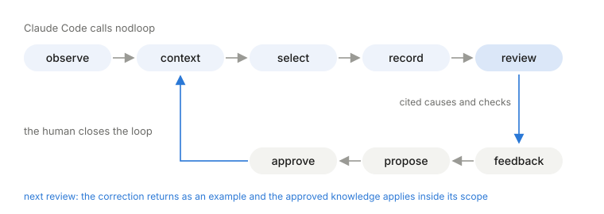
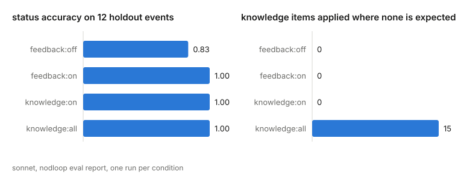

<div align="center">
  <picture>
    <source media="(prefers-color-scheme: dark)" srcset=".github/logo-dark.svg">
    <source media="(prefers-color-scheme: light)" srcset=".github/logo-light.svg">
    
  </picture>
</div>

<div align="center">
  <h3>Procedure-grounded incident reviews inside Claude Code. Your corrections become approved knowledge that feeds the next review.</h3>
</div>

<div align="center">
  <a href="https://github.com/jeon-jihyeon/nodloop/releases"></a>
  <a href="https://github.com/jeon-jihyeon/nodloop/actions/workflows/test.yml"></a>
  <a href="https://goreportcard.com/report/github.com/jeon-jihyeon/nodloop"></a>
  
  
</div>

<br>

Claude Code writes the review with its own model, so there's no API key to set up. nodloop gives it the numbers, computed from your events by plain code, and the paragraphs of the procedures that fit the event, which it can cite. When you correct a review, the correction can become a knowledge item, used only after someone approves it and only on events that match its scope.

> [!TIP]
> The last part of the recording, where the guard blocks `sed -i`, needs the hook and vetoes from the [Guard](#guard) steps below.


## Quickstart

Clone the repository for its demo set of 24 synthetic traffic events in `examples/demo`, then install the plugin in Claude Code:

```
git clone https://github.com/jeon-jihyeon/nodloop
```

```
/plugin marketplace add jeon-jihyeon/nodloop
/plugin install nodloop@nodloop
```

On first run, the plugin downloads its binary. Start Claude Code in the directory where you ran `git clone`, so `./nodloop/examples/demo` resolves. Ask Claude Code to point nodloop at the demo, then run one full loop. The server reads the new directory on its next call, with no reconnect:

```
> set up nodloop with the demo in ./nodloop/examples/demo
> review the conversions of September 18 to 19 with nodloop
> That is attribution lag. Conversions arrive up to 4 hours after the click, so the newest 4 hours always read low. Record that as feedback and propose it as knowledge.
> approve it, approver <your name>
> review the conversions of September 20 to 21 with nodloop
```

The second review applies the knowledge you approved. Each demo event spans its own two days, so you name an event by when it happened, and by a source when one matters, never by an id.

> [!TIP]
> Setup runs `~/.nodloop/bin/nodloop check` and `~/.nodloop/bin/nodloop setup` through Bash, so Claude Code asks for permission the first time. To skip that prompt, add `"Bash(~/.nodloop/bin/nodloop check *)"` and `"Bash(~/.nodloop/bin/nodloop setup *)"` to `permissions.allow` in `~/.claude/settings.json`. The plugin keeps that path linked to the binary it runs, so the rules hold across updates.

<details>
<summary>Moving from the demo to your own data and record directory</summary>

When you are done with the demo, point nodloop at your own directory the same way and ask for a new record directory too, such as `~/.nodloop/own-records`. Otherwise the demo reviews, corrections and knowledge stay in `~/.nodloop/records` and carry into reviews of your data, and setup warns about that. `NODLOOP_RECORD_DIR` wins over the record directory setup saves, so while it is set point it at a new directory instead. `NODLOOP_FILE_DIR` wins over the saved data directory the same way, and setup warns when it names another one.

Your directory needs `events.csv`, `policy.yaml` and your procedures as Markdown files under `procedures/`, and nodloop reads the change context of each event from `contexts.csv`. When your data comes in another shape, such as another CSV layout, several files or Parquet, Claude Code writes a `convert.py` beside it that rewrites `events.csv` and `contexts.csv`, saves it only after you approve a preview, and reruns it before each review when a source file is newer. It needs python3, and the duckdb CLI only for a source such as Parquet. When the directory has no `policy.yaml`, Claude Code proposes one from the profile of your events and writes it only after you approve it. `nodloop check --data-dir <dir>` prints what nodloop reads there and the error that stops it, and writes nothing. Setup warns when `contexts.csv` is missing, since every event then reads the change context `unknown`. Setup fails when `policy.yaml` names a metric or dimension that no event carries, so a misspelled name never leaves reviews without their numbers. A running server instead reports such a name in every review, so an export taken during an outage still gets reviewed.

</details>

<details>
<summary>Format of events.csv and contexts.csv</summary>

`events.csv` needs the columns `event_id`, `timestamp` in RFC 3339, `metric` and `value`, in any order. Every other named column is a dimension of the series, such as a source or a region, so its values must repeat across rows. A column that differs on every row, like a row id or a note, splits every series into single points. A row repeated with the same value is read once, and one repeated with another value fails the load with both lines named.

`contexts.csv` needs the columns `event_id` and `change_context`, one row per event, and the context is one that `policy.yaml` declares under `contexts`, each with a name and whether it breaks the baseline. A policy without that list declares `no_known_change`, `planned_operational_change`, `measurement_context_changed`, `data_availability_issue` and `unknown`, and only the measurement and data availability ones break the baseline. An event without a row reads `unknown`. A bad row in either file fails only the tools that read events, so the queue and the verdicts keep working while you fix it.

</details>

<details>
<summary>Layout of procedure files</summary>

Each procedure is a `.md` file directly under `procedures/`, and setup fails when there is none. Setup warns about Markdown it will not read, such as `.markdown` files or a subfolder, or a link to one, that holds `.md` files at any depth or that it cannot open. The `#` heading is the title and each heading below it is a step. The first step is a check the review must list and never cites for a cause, so an overview or a list of likely causes must not come first. A heading named exactly `Decide` states the decision and is never cited for a cause, while a heading named Decision is read as an ordinary step. A paragraph id comes from its heading text and its place within the section, so renaming a heading changes its ids and moving a section to the front makes it the check. [metric-anomaly-investigation.md](examples/demo/procedures/metric-anomaly-investigation.md) shows the shape. Ask Claude Code to import runbooks you keep in another form, such as a wiki export or a PDF: it drafts one procedure per runbook in this shape, shows each as a diff and writes it only after you approve it, and never edits the runbook itself.

</details>

## Why nodloop

- **Grounded in procedure paragraphs**: a cause without a citation, or a status that contradicts the causes, gets the review sent back once, and a second miss puts it on hold
- **Corrections become approved knowledge**: a correction is used only after someone approves it, and only on events that match its scope
- **Refuses instead of cutting**: when approving an item would outgrow the knowledge budget of a review, nodloop refuses and asks you to make room instead of cutting text or items you never see
- **Guard blocks vetoed calls**: a PreToolUse hook blocks tool calls you've vetoed before they run, so the model can't talk its way past it
- **Measured by eval**: the Measured numbers come from `nodloop eval`, with feedback off, corrections, scoped knowledge and unscoped knowledge side by side

## How it works

<picture>
  <source media="(prefers-color-scheme: dark)" srcset=".github/loop-dark.svg">
  
</picture>

<details>
<summary>How reviews are checked, and how knowledge is approved, budgeted and kept fresh</summary>

A cause without a citation, or a status that contradicts the causes, gets the review sent back once, and a second miss puts it on hold. A Decide paragraph or a first step doesn't count as a citation for a cause. A corrected review goes through the same check against the procedures that fit the event now, so an edit that the next review could only follow into a hold is refused with the reason, including one that cites a paragraph a renamed heading took away. An edit that cites more than two paragraphs for one cause is refused too, because the next review keeps only the first two.

A new version of a knowledge item that would reach events the approved one never reached is refused until the approved one is retired. If approving an item would make the knowledge a review carries outgrow its budget of 70,000 characters or 10 items, nodloop refuses and asks you to retire an item, replace one, scope it to other change contexts or compact the folder so each review carries fewer items, instead of cutting text or items you never see.

Knowledge doesn't stay approved forever without a look. When a real check refutes a review, record the outcome and nodloop can propose a narrower version of the knowledge it used, or tell you to keep or retire it when it failed in every change context it covers. When real checks confirmed the reviews that used an item and none refuted them, nodloop can propose the same item as verified, which someone approves like any new version. An approved version is flagged as stale 90 days after its approval until someone reaffirms it. Reviews, verdicts and knowledge versions are all kept in `~/.nodloop/records`. Ask Claude Code what an earlier review of an event said or used, and it reads the traces through `nodloop trace`. `nodloop report online` puts the reviews that applied knowledge beside those without on verdict rates, the time to a verdict and how many fields an edit changed. When you correct or reject a review, Claude Code asks what it got wrong, the status, a cause, a citation, the checks or something else, and the report counts those reason codes per week.

</details>

## Measured

The eval holds out 12 of the 24 demo events and reviews them with Sonnet. With no feedback, 10 of 12 got the right status. With corrections or approved knowledge, all 12 did. Applying every knowledge item regardless of scope also gets 12, but drags in 15 items that don't belong.

<picture>
  <source media="(prefers-color-scheme: dark)" srcset=".github/measured-dark.svg">
  
</picture>

<details>
<summary>Demo eval table and how to reproduce it</summary>

| condition | events | status acc | hold acc | citation p | citation r | required checks | first check | knowledge hit | misapplied | revised | mean cost usd |
|---|---|---|---|---|---|---|---|---|---|---|---|
| seed | 12 | 0.83 | 1.00 | 0.94 | 1.00 | 1.00 | 1.00 | 0.00 | 0 | 0 | 0.1045 |
| feedback:off | 12 | 0.83 | 1.00 | 1.00 | 1.00 | 1.00 | 1.00 | 0.00 | 0 | 1 | 0.1098 |
| feedback:on | 12 | 1.00 | 1.00 | 0.92 | 1.00 | 1.00 | 0.75 | 0.00 | 0 | 0 | 0.0784 |
| knowledge:on | 12 | 1.00 | 1.00 | 0.86 | 1.00 | 1.00 | 0.75 | 1.00 | 0 | 2 | 0.1142 |
| knowledge:all | 12 | 1.00 | 1.00 | 0.78 | 0.92 | 1.00 | 0.75 | 1.00 | 15 | 1 | 0.1046 |

To reproduce it, first set `NODLOOP_RECORD_DIR` to the absolute path of an empty directory, because the Quickstart reviewed and corrected the event of September 18 to 19, a holdout event, and holdout refuses records that already judge one. Then run `~/.nodloop/bin/nodloop eval seed --session demo` from the clone, correct the seed reviews with `feedback add`, import the demo knowledge with `knowledge import --file examples/demo/knowledge.jsonl`, then run `eval holdout --session demo` and `eval report --session demo` with the same binary. eval calls the `claude` CLI for every review. holdout stops before the first review when feedback:on has no corrected seed review or the knowledge conditions have no approved item, so leave a condition out with `--conditions` to run the rest. After a compaction, knowledge that replaced an item a label expects still counts as a hit.

</details>

### Beyond the demo

Nothing in the core knows about the demo's domain. The same loop ran on 300 events built from the public [Tennessee Eastman Process data of Rieth et al.](https://doi.org/10.7910/DVN/6C3JR1), a simulated chemical plant with seeded faults. In 36 held-out events a trap decides the status. With no feedback, none of them got it right. With corrections all 36 did, and with scoped knowledge 35 did, which never landed on an event outside its scope. Applying every item regardless of scope landed 548 items that don't belong.

<details>
<summary>Tennessee Eastman eval table and setup</summary>

Five procedures, four planted traps and a scripted reviewer stood in for a plant team, so no human took part. 150 events were seed and 150 held out, all reviewed with Sonnet.

| condition | events | status acc | hold acc | citation p | citation r | required checks | first check | knowledge hit | misapplied | revised | mean cost usd |
|---|---|---|---|---|---|---|---|---|---|---|---|
| seed | 150 | 0.75 | 0.60 | 0.69 | 0.95 | 0.86 | 0.82 | 0.00 | 0 | 32 | 0.0877 |
| feedback:off | 150 | 0.76 | 0.60 | 0.73 | 0.98 | 0.86 | 0.82 | 0.00 | 0 | 29 | 0.0907 |
| feedback:on | 150 | 0.99 | 1.00 | 0.97 | 0.98 | 0.99 | 0.99 | 0.00 | 0 | 1 | 0.0587 |
| knowledge:on | 150 | 0.99 | 1.00 | 0.81 | 0.98 | 0.98 | 0.93 | 1.00 | 0 | 25 | 0.0755 |
| knowledge:all | 150 | 0.99 | 1.00 | 0.88 | 0.98 | 0.99 | 0.91 | 1.00 | 548 | 27 | 0.0854 |

</details>

## Guard

`nodloop guard` blocks tool calls you've vetoed before they run. It's a PreToolUse hook, so the model can't talk its way past it.

```
~/.nodloop/bin/nodloop guard install
curl -fsSL --create-dirs https://raw.githubusercontent.com/jeon-jihyeon/nodloop/main/examples/vetoes.yaml -o ~/.claude/nodloop/vetoes.yaml
~/.nodloop/bin/nodloop guard check
```

The seed vetoes read `commands`, which the guard derives from the Bash or Monitor `command` with a shell parser: one line per simple command, also inside loops, pipes and substitutions, without quotes, so a word inside a quoted argument or a heredoc never counts as a command. The header of [vetoes.yaml](examples/vetoes.yaml) states what it still can't follow, such as variables and the string given to `bash -c`, which the seeds block outright.

A veto you write by hand can say `action: ask` to hand the call to you with its reason instead of blocking it, and a matching veto that blocks always wins over one that asks. Every block and ask is logged to `~/.nodloop/guard.jsonl` with the veto, the tool and the directory but never the command, and `nodloop guard log` prints the newest ones.

A correction can become a veto too. Propose it as a judgment with a veto, and once someone approves it, nodloop writes it to an approved veto file under `~/.claude/nodloop` and the guard blocks that call from then on. Such a judgment acts only through the guard, so no review carries it and vetoes never use up a review's budget. Retiring the knowledge removes the veto, a new version that drops it is refused, and a veto you write by hand wins over an approved one with the same id.

<details>
<summary>Hook install, health check and where veto files are found</summary>

`guard install` backs up `~/.claude/settings.json` before adding the hook, and `guard uninstall` removes it. It registers `~/.nodloop/bin/nodloop`, which the plugin points at the binary it ran last, even one it found on PATH, and running it again repairs a hook whose binary is gone. `guard check` lists the veto files it found and ends with whether the hook is installed, turned off by `disableAllHooks`, or stale because it still runs an older plugin binary after an update, which `guard install` repairs. A `.claude/nodloop/vetoes.yaml` applies anywhere below its directory. The guard looks for one from the working directory up to the nearest directory holding `.git`, or up to home when there is none and only in the working directory outside both, and the nearer file wins on the same id. While a veto file under home isn't valid YAML, the guard blocks every call except reading and editing veto files, so one bad write can't turn your vetoes off.

</details>

## Supported

macOS and Linux, or Windows through WSL. It runs as a Claude Code plugin. For Codex, Cursor or another MCP client, install it with `go install github.com/jeon-jihyeon/nodloop/cmd/nodloop@latest`, run `nodloop setup --data-dir <dir>` once and serve it with `nodloop mcp`. Outside Claude Code nobody converts your data, so bring it in the layout above and run `nodloop check --data-dir <dir>` until it passes. nodloop has no reader for other formats such as Parquet or a DuckDB database and none is planned.

## Limits

Every procedure whose scope fits the event goes to the model in full, and a procedure without a scope fits every event. A large set of broad procedures means a large context.

## License

MIT. The nodloop name and logo are not part of the license. Please use your own name and logo for a fork.

---

## Resources

- [Demo data set](examples/demo): 24 synthetic traffic events with procedures, policy, labels and knowledge
- [Contributing](CONTRIBUTING.md): how to build, test and send changes
- [Security](SECURITY.md): how to report a vulnerability
- [Releases](https://github.com/jeon-jihyeon/nodloop/releases): darwin and linux archives the plugin downloads
- [Issues](https://github.com/jeon-jihyeon/nodloop/issues): bug reports and feature requests
